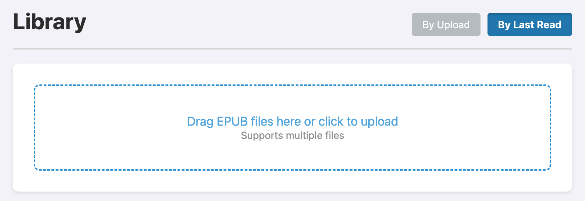

# reader 3



A lightweight, self-hosted EPUB reader that lets you read through EPUB books one chapter at a time. This makes it very easy to copy paste the contents of a chapter to an LLM, to read along. Optimized for a clean reading experience with logical chapter splitting, cover support, and reading history.

## Features
- **Logical Chapter Splitting**: Automatically splits large EPUB files into readable segments based on TOC.
- **Web Upload**: Upload multiple EPUB files directly through the browser.
- **Reading History**: Keeps track of your reading progress and sorting.
- **Docker Support**: Easy deployment using Docker and Docker Compose.
- **Unraid Ready**: Includes a template for easy Unraid deployment.
- **CI/CD**: Automatic Docker image building and publishing via GitHub Actions.

## Usage

### Using Docker (Recommended)
The easiest way to run reader3 is using Docker Compose:

```bash
docker-compose up -d
```

Visit [localhost:8123](http://localhost:8123/) to access your library.

### Local Development
The project uses [uv](https://docs.astral.sh/uv/).

1. **Run the server**:
   ```bash
   uv run python app/server.py
   ```
2. **Upload books**: Use the web interface to upload your EPUB files. They will be automatically processed and added to your library.

Alternatively, you can manually process a book via CLI:
```bash
uv run python app/reader3.py your_book.epub
```

## Deployment

### Docker Compose
Modify the `volumes` in `docker-compose.yml` to point to your desired data and upload directories.

### Unraid
Use the provided `unraid-template.xml` to add a new container in your Unraid dashboard.

## License

MIT